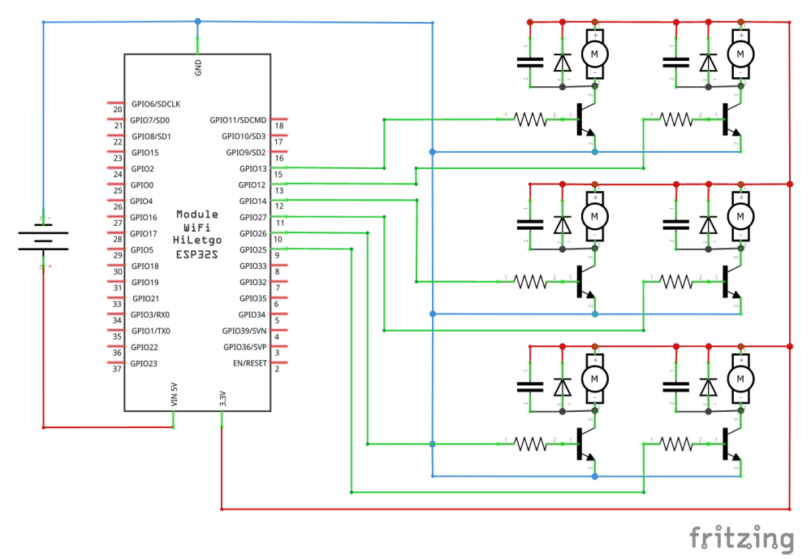

# DIY Data Glove Build Instructions


The following document gives an overview of how the DIY data glove can be created. 
## Hardware Components
For one glove the following components are needed:

- 1 ESP32 microcontroller
- Power bank or other power source to power the ESP32 during use.
- **For each** finger (and palm) the following is required
    - 1 resistor (1KOhm)
    - 1 transistor (2N2222)
    - 1 diode (1N4001)
    - 1 capacitor (100nF)
    - 1 small vibration actuator

The required values may differ based on your selected components.

## Building the Hardware
The layout of the glove can be seen in the following overview.
Each actuator is connected with power and can be controlled through pulse-width modulation through an **analog** GPIO pin of the ESP32.
Depending on the exact module, the pins may vary and the spec sheet of your microcontroller should be consulted.


Instead of soldering the actuators directly to the other components or a soldering board it may be advised to use modular plugs instead. This way it is possible to only use a reduced set of actuators or replace a faulty one.

## Software for the Microcontroller
The ESP32 was flashed using the Arduino IDE.
The used code can be found in `data_gloves/src/hand_controller.ino`.
For easy identification, it is advised that each controller gets a unique name (e.g. left and right) if more than one esp is being used. For this, replace the string in `SerialBT.begin("Controller-right")` with your preferred name.

Depending on the used GPIO pins you may want to change the mapping of the pins in the source code.
Each finger (and the palm) get assigned an incrementing Id beginning at zero, that is later used to control the associated actuator.

The line `int fingerPins[] = { 12, 13, 14, 25, 26, 27 };` assigns each of these indices the associated GPIO pin. Therefore in this example the index finger is GPIO 13 and the PALM is mapped to GPIO 27. Feel free to change this if your pins differ.

## Connecting to Windows 10
With the hardware build and the flashed microcontroller the hardware is now ready for use.
For this connect the micro-usb port of the microcontroller to a power source. If the controller
provides an debug led it should be lit.

Connect the bluetooth dongle, if your computer doesn't have built-in bluetooth connectivity.
Going into Settings/Bluetooth the Controller should now show up when trying to connect to new devices.

## Testing the Controller
To test the implementation a simple string can be sent to the device. For this we can use [Bluetooth Serial Terminal](https://www.microsoft.com/de-de/p/bluetooth-serial-terminal/9wzdncrdfst8?activetab=pivot:overviewtab).

1. Refresh the device list and select the device you want to test (e.g. 'controller-right').
2. Press connect. We can send strings to the device.
3. Send the string "`0,255;`". One of the vibration motors should now be vibrating with full strength.
4. Send the string "`0,0;`". The same motor should stop vibrating.

If all went well the glove is ready for use in your projects.

## Protocol
The provided script of the microcontroller expects two values separated by a comma "`,`" followed by a semicolon "`;`". 
The first value is an integer that controls the actuator that should be triggered.
The second value is the intensity of the vibration. A value between 0-255. Zero is no vibration. 255 is full intensity (Note that depending on the used motor, it may not trigger for small values <50).
Multiple values can be sent with one message e.g.:
```
0,255;1,0;2,255;
```
Sets the first and third actuator to max and the second to zero intensity. All other connected actuators are unchanged!

## Fixation of the Actuators
The easy way to fixate the actuators to ones finger is the use of small velcro straps. 
For a more "sophisticated" method it is possible to the attach the actuators to a glove.
The image below shows an inner glove with six pockets in which the actuators can be placed. 
A bigger glove can worn above the inner glove so that the cables are out of the way during the usage of the glove.

TODO: Add image

## Printing an Enclosure
Additionally to the hardware an enclosure can be 3d-printed. This protects the hardware and also makes it easier to use.
The size of the case depends on the size of your hardware and power source.
An example OpenScad file is provided with 'data_gloves/enclosure.scad'.
The dimensions of the casing can be customized with the variables at the beginning of the file.
If the `strapholder` variable is set to `true` set of two holes on each side will be added, that can be used to fixate the device to ones hand (e.g. using velcro straps. See image at the top).


## Acknowledgements
These instructions are based on the initial version of the glove in "[Evaluation of different types of haptic feedback influencing the task-based presence and performance in virtual reality](https://dl.acm.org/doi/10.1145/3316782.3321536)". We thank the other team members involved there and especially Oliver Friedmann for the support during the initial development.
